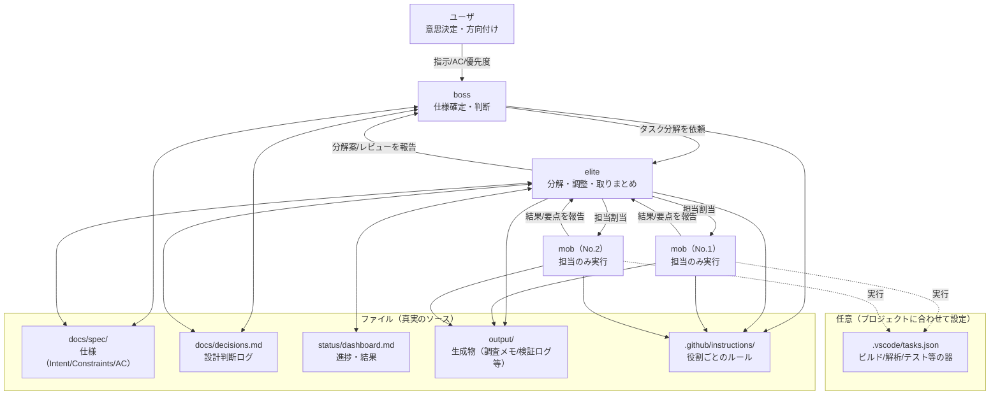

# multiAgent（Python・シェルなし / 仕様駆動 + SOLID）

添付のまとめ（VS Code + Copilot Agent運用 / 仕様駆動 / SOLID / dashboard）を踏襲し、
**Pythonやシェルスクリプトに依存しない**形で「boss→elite→mob×N（並列）」を運用するためのベース環境です。

## ユーザ向け：最初に押さえる4点

- **ユーザの読むべき部分**：この `README.md` と `docs/USAGE.md`
- **ユーザの準備すべき部分**：`docs/USAGE.md` の「VS Code 側で行うこと（設定）」
- **ユーザが入力する部分**：Copilot Chat（Agentモード）で **boss** に依頼（テンプレは `docs/USAGE.md`）
- **ユーザが監視する部分**：`status/dashboard.md`（見方の説明は `docs/ARCHITECTURE.md`）

## 概念図（この環境が提供するもの）

## ここでやること

- `.github/copilot-instructions.md` と `.github/instructions/*.instructions.md` にルールを集約
- `docs/spec/` に仕様を Markdown で残す
- `docs/decisions.md` に設計判断を残す
- `status/dashboard.md` で進捗可視化
- `output/` に生成物（調査メモ、検証ログ、ビルド生成物など）を集約
- VS Code の `tasks.json` で、タスク（例：ビルド/解析/テスト）を **並列実行**

## 主要ファイル

- `.github/copilot-instructions.md`：全体ルール（仕様駆動/ SOLID / 小さく変更 / docs更新）
- `.github/instructions/`：用途別ルール（boss/elite/mob/ドキュメント）
- `docs/spec/`：仕様（Markdown）
- `docs/decisions.md`：設計判断ログ
- `status/dashboard.md`：進捗ダッシュボード
- `output/`：生成物置き場（Git管理しないのが基本）
- `.vscode/tasks.json`：並列実行の要

## クイックスタート（ユーザ向け）

**初回セットアップ（1回だけ）:**

- VS Code の前提設定は `docs/USAGE.md` を参照（Agent / instruction files / runSubagent）

**タスクの依頼方法（毎回）:**

1. Copilot Chat でエージェントを **boss** に切り替え
2. やりたいことを自然言語で指示（テンプレートは `docs/USAGE.md` 参照）
3. bossが「お伺い」してきたら選択肢を選ぶ
4. `status/dashboard.md` で進捗を確認

> 詳しくは `docs/USAGE.md` の「ユーザの役割：bossへの指示の出し方」を参照。

## 使い方（詳細）

`docs/USAGE.md` を参照。

## VS Code側の前提（入口）

このリポジトリは、VS Code の Copilot Chat（Agentモード）を前提にした“運用基盤”です。
具体的な設定手順は `docs/USAGE.md` に集約しています（README では重複を避けます）。

