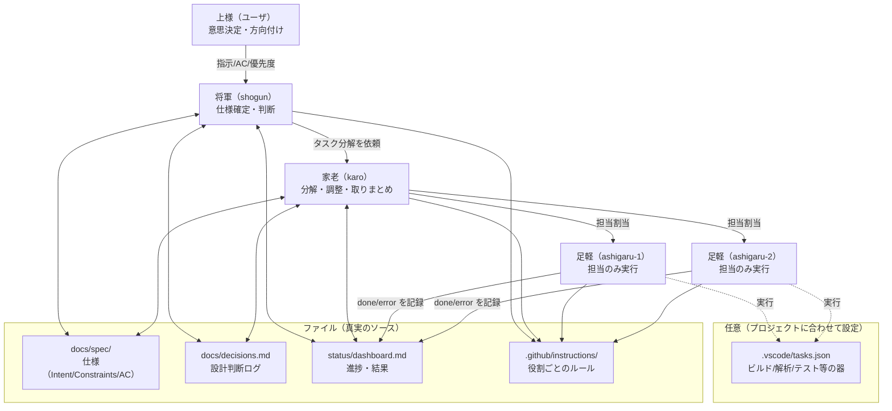

# multiAgent（Python・シェルなし / 仕様駆動 + SOLID）

添付のまとめ（VS Code + Copilot Agent運用 / 仕様駆動 / SOLID / dashboard）を踏襲し、
**Pythonやシェルスクリプトに依存しない**形で「将軍→家老→足軽×N（並列）」を運用するためのベース環境です。

## 概念図（この環境が提供するもの）

## ここでやること

- `.github/copilot-instructions.md` と `.github/instructions/*.instructions.md` にルールを集約
- `docs/spec/` に仕様を Markdown で残す
- `docs/decisions.md` に設計判断を残す
- `status/dashboard.md` で進捗可視化
- VS Code の `tasks.json` で、タスク（例：ビルド/解析/テスト）を **並列実行**

## 主要ファイル

- `.github/copilot-instructions.md`：全体ルール（仕様駆動/ SOLID / 小さく変更 / docs更新）
- `.github/instructions/`：用途別ルール（将軍/家老/足軽/ドキュメント）
- `docs/spec/`：仕様（Markdown）
- `docs/decisions.md`：設計判断ログ
- `status/dashboard.md`：進捗ダッシュボード
- `.vscode/tasks.json`：並列実行の要

## 使い方

`docs/USAGE.md` を参照。

## VS Code側の前提（これだけ設定）

このリポジトリは、VS Code の Copilot Chat を前提にした“運用基盤”です（リポジトリ側から設定を強制はできません）。

- Copilot Chat を **Agent** モードで使う
- instruction files を有効化
	- `github.copilot.chat.codeGeneration.useInstructionFiles: true`
- Subagents を使う（ツールピッカーで `runSubagent` を有効化）
	- 可能なら `chat.customAgentInSubagent.enabled: true`

